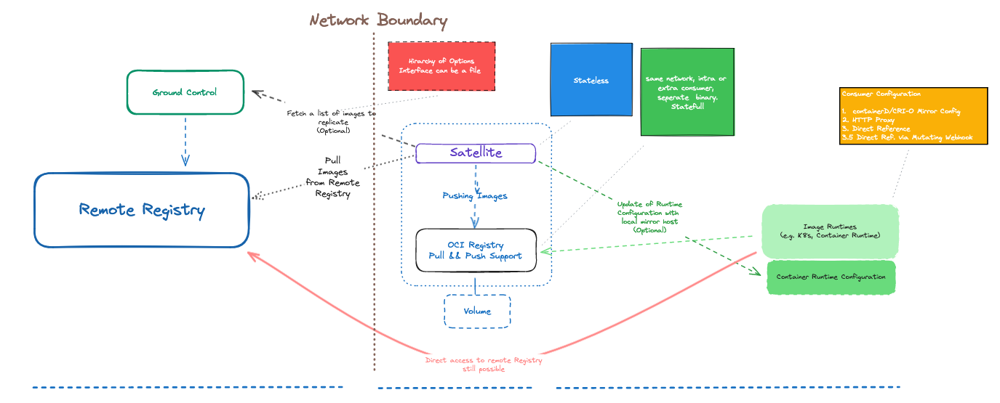
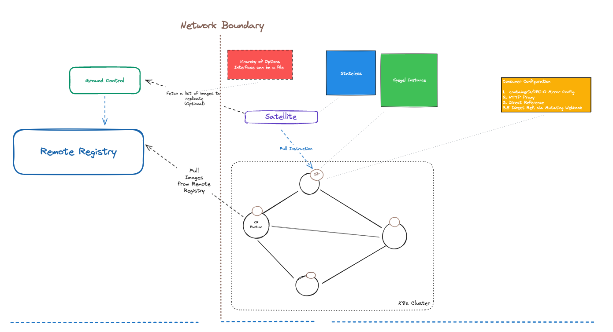
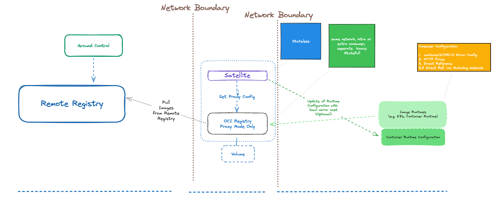

# Proposal: `Harbor Satellite`

Authors: Vadim Bauer / [Vad1mo](https://github.com/Vad1mo), Csaba Almasi, Philip Laine, David Huseby / [dhuseby](https://github.com/dhuseby),  Roald Brunell / [OneFlyingBanana](https://github.com/OneFlyingBanana)

## Abstract

Harbor Satellite aims to bring Harbor container registries to edge locations, ensuring consistent, available, and integrity-checked images for edge computing environments. This proposal outlines the development of a stateful, standalone satellite that can function as a primary registry for edge locations and as a fallback option if the central Harbor registry is unavailable.

## Background

In recent years, containers have extended beyond their traditional cloud environments, becoming increasingly prevalent in remote and edge computing contexts. These environments often lack reliable internet connectivity, posing significant challenges in managing and running containerized applications due to difficulties in fetching container images. To address this, the project aims to decentralize container registries, making them more accessible to edge devices. The need for a satellite that can operate independently, store images on disk, and run indefinitely with stored data is crucial for maintaining operations in areas with limited or no internet connectivity.

## Proposal

The proposed change is to develop "Harbor Satellite", an extension to the existing Harbor container registry. This extension will enable the operation of decentralized registries on edge devices.

Harbor Satellite will synchronize with the central Harbor registry, when Internet connectivity permits it, allowing it to receive and store images. This will ensure that even in environments with limited or unreliable internet connectivity, containerized applications can still fetch their required images from the local Harbor Satellite.

Harbor Satellite will also include a toolset enabling the monitoring and management of local decentralized registries.

## Non-Goals

T.B.D.

## Rationale

Deploying a complete Harbor instance on edge devices in poor/no coverage areas could prove problematic since :

- Harbor wasn't designed to run on edge devices.(e.g. Multiple processes, no unattended mode)
- Harbor could behave unexpectedly in poor/no connectivity environments.
- Managing hundreds or thousands of container registries is not operationally feasible with Harbor
- Harbor would be too similar to a simple registry mirror

Harbor Satellite aims to be resilient, lightweight and will be able to keep functioning independently from Harbor instances.

## Compatibility

Compatibility with all container registries or edge devices can't be guaranteed.

## Implementation

### Overall Architecture

Harbor Satellite, at its most basic, will run in a single container and will be divided in the following 2 components :

- **Satellite Core** : pulling/pushing images from/to Harbor (using go-libp2p?) and pulling/pushing images from/to the local registry (using Skopeo and/or Crane?).
- **Registry Proxy** : storing required OCI artifacts locally (using zotregistry or docker registry?).

<em>Basic Harbor Satellite Diagram</em>

### Specific Use Cases

Harbor Satellite may be implemented following 1 or several of 3 different architectures depending on its use cases :

1. **Replicating from a remote registry to a local registry.**  
In this basic use case, the stateless satellite component will handle pulling images from a remote registry and then pushing them to the local OCI compliant registry. This local registry will then be accessible to other local edge devices who can pull required images directly from it.
_(A direct access from edge device to the remote registry is still possible when network conditions permit it)._  
The satellite component may also handle updating container runtime configurations and fetching image lists from Ground Control, a part of Harbor.  
The stateful local regsitry will also need to handle storing and managing data on local volumes.

<em>Use case #1</em>

2. **Replicating from a remote regsitry to a local Spegel Registry**  
The stateless satellite component send pull instructions to Spegel instances running with each node of a Kubernetes cluster. The node will then directly pull images from a remote registry and share it with other local nodes, removing the need for each of them to individually pull an image from a remote registry.

<em>Use case #2</em>

3. **Proxying from a remote regsitry over the local registry**  
The stateless satellite component will be in charge of configuring the local OCI compliant registry, which will be running in proxy mode only. This local registry will then handle pulling necessary images from the remote registry and serving them up for use by local edge devices.

<em>Use case #3</em>

### Consumer Configuration

In each of these use cases, we need to ensure that consumers will be able to access the registry and pull images from it. To solve this issue, we propose 4 solutions :

1. By using **containerd** or **CRI-O** and  configuring a mirror within them.
2. By setting up an **HTTP Proxy** to manage and optimize pull requests to the registry.
3. By **directly referencing** the registry.
4. By **directly referencing** the registry and using Kubernetes' mutating webhooks to point to the correct registry.

## Open issues (if applicable)

T.B.D.
